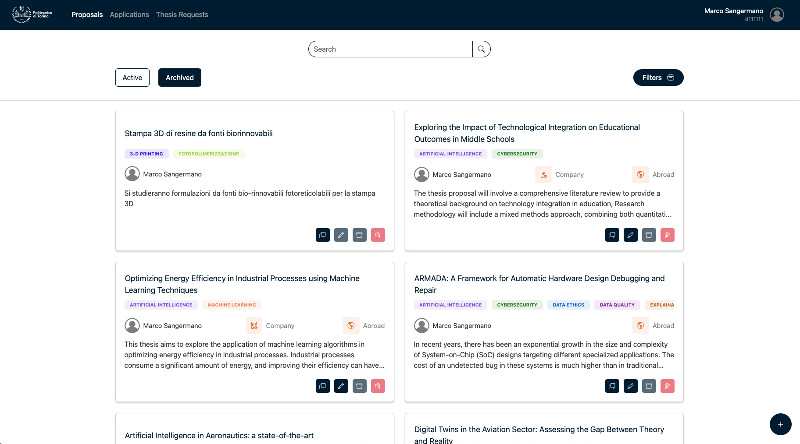
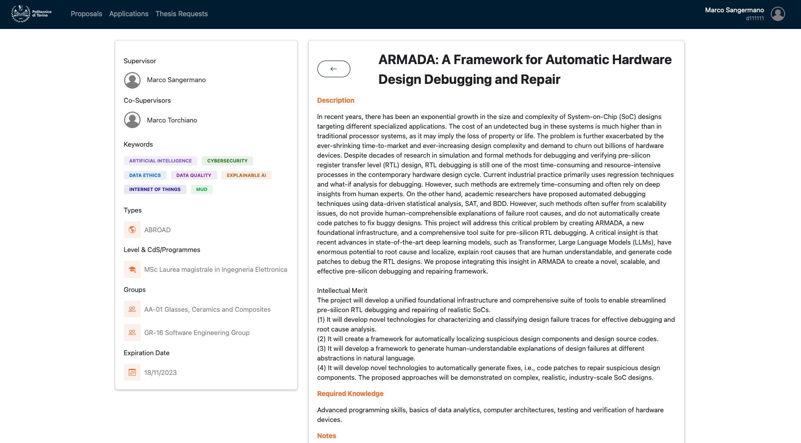

# SE2 - Thesis Managment

## Home

## Thesis Details

# Server side

## API Server

### Miscellaneous

- GET `/api/keywords`
  - request parameters: none.
  - response body content: list of keywords.
- GET `/api/user`
  - request parameters: none.
  - response body content: an object including all the information of the authenticated user: unique identifier, name, surname and email.
- GET `/api/types`
  - request parameters: none.
  - response body content: list of types.
- GET `/api/teachers`
  - request parameters: none.
  - response body content: list of teachers identified with name, surname and email.
- GET `/api/groups`
  - request parameters: none.
  - response body content: list of groups identified with code of the group and the related name.
- GET `/api/cds`
  - request parameters: none.
  - response body content: list of cds identified with the code of the degree and the related title.

### API over Thesis

- POST `/api/thesis`
  - request parameters: none.
  - request body content: an object that may containing filters: a list of keywords, a list of types, a supervisor, a list of co-supervisors, a list of groups and an expiration date. 
  - response body content: list of thesis identified with an identifier, a title, a description, required knowledge, notes, expiration date, the level, related degree, a list containing the related types and a list containing the related keywords.
- GET `/api/thesis/:id/groups`
  - request parameters: thesis identifier.
  - response body content: a list of groups identified with a code and a name.
- POST `/api/insert/thesis`
  - request body content: an object including all the data necessary to insert a new thesis: a title, a description, required knowledge, notes, expiration date, the level, related degree, a list of co-supervisors, a list of types and a list of keywords.
  - response body content: the identifier of the thesis created.
- GET `/api/thesis/:id`
  - request parameters: thesis identifier.
  - response body content: an object including all the data related to a thesis: a title, a description, required knowledge, notes, expiration date, the level, related degree, the supervisor and a list of co-supervisors, the list of groups to which the supervisors belong, a list of related keywords and a list of related types.
- PUT `/api/edit/thesis/:id`
  - request parameters: thesis identifier.
  - request body content: an object including all the data necessary to update a thesis: a title, a description, required knowledge, notes, expiration date, the level, related degree, a list of co-supervisors, a list of related keywords and a list of related types.
  - response body content: the identifier of the just modified thesis.
- POST `/api/delete/thesis`
  - request parameters: none.
  - request body content: thesis identifier.
  - response body content: a message indicating the outcome of the deleting process.
- POST `/api/archive/thesis`
  - request parameters: none.
  - request body content: thesis identifier.
  - response body content: a message indicating the outcome of the archiving process.

### API over Applications

- POST `/api/thesis/:id/apply`
  - request parameters: thesis identifier.
  - request body content: none.
  - response body content: a message indicating the outcome of the application process. 
- GET `/api/thesis/applications/browse`
  - request parameters: none.
  - response body content: 
    - if called by a `teacher`: a list of applications for all the theses for which the professor is the supervisor. The object is composed of: thesis identifier, its title, thesis's expiration date, the level, the degree, the identifier of student who applied, student's name, student's surname, student's email and the application's state.
    - if called by a `student`: a list of applications with which he has interacted. The object is composed of:
    thesis identifier, its title, thesis' expiration date, the level, the degree, supervisor's identifier, supervisor's name, supervisor's surname, application's state, the list of keywords for that thesis and the list of types for that thesis.
- POST `/api/accept/application`
  - request parameters: none.
  - request body content: student identifier and thesis identifier.
  - response body content: a string 'Accepted' validating the success of the operation.
- POST `/api/reject/application`
  - request parameters: none.
  - request body content: student identifier and thesis identifier.
  - response body content: a string 'Rejected' validating the success of the operation.
- POST `/api/applications/details`
  - request parameters: none.
  - request body content: application identifier.
  - response body content: an object containing the student's information: list of exams, the state and eventually a related cv.

### API over Requests

- GET `/api/requests`
  - request parameters: none.
  - request body: none.
  - response body content:
    - if called by a `teacher`: a list of requests that have been approved by the secretary and that have as supervisor the user, along with their status.
    - if called by a `student`: the list of requests that the student has performed, along with their status.
    - if called by a `secretary clerk`: a list of requests made by any student to any professor, along with their status.   
- POST `/api/insert/request`
  - request body: all the data necessary to create a new request: the supervisor's identifier, a title, a description and an array containing the co-supervisors.
  - response body content: a message indicating the outcome of the insert process.
- POST `/api/approve/request/secretary`
  - request body: the identifier of the request that should be approved by secretary.
  - response body content: a message indicating the outcome of the approve process.
- POST `/api/reject/request/secretary`
  - request body: the identifier of the request that should be rejected by secretary.
  - response body content: a message indicating the outcome of the reject process.
- POST `/api/approve/request/professor`
  - request body: the identifier of the request that should be approved by a professor.
  - response body content: a message indicating the outcome of the approve process.
- POST `/api/reject/request/professor`
  - request body: the identifier of the request that should be rejected by a professor.
  - response body content: a message indicating the outcome of the reject process.  
- POST `/api/change/request/professor`
  - request body: the identifier of the request that needs changes, a note containing the changes to be made.
  - response body content: a message indicating the outcome of the request change process.  

### API Virtual Clock 
- GET `/api/virtualClockStatus`
  - request parameters: none.
  - response body content: 
    - Virtual Clock On: a string representing the predefined date.
    - Virtual Clock Off: valute "0".
- PUT `/api/virtualClockOn`
  - request parameters: none.
  - request body content: the date to set.
  - response body content: a string 'Updated' validating the succes of the operation.
- PUT `/api/virtualClockOff`  
  - request parameters: none.
  - request body content: none.
  - response body content: a string 'Updated' validating the succes of the operation.

## Database Main Tables

- Table `Student` : (id, name, surname, gender, nationality, email, enrollment_year, cod_degree)
- Table `Teacher` : (id, name, surname, email, cod_group, cod_department)
- Table `Secretary_Clerk` : (id, name, surname, email)
- Table `Degree` : (cod_degree, title_degree)
- Table `Career` : (id, cod_course, title_course, cfu, grade, date)
- Table `Group` : (cod_group, name)
- Table `Department` : (cod_department, name)
- Table `Thesis` : (id_thesis, title, description, required_knowledge, notes, expiration_date, level, degree, supervisor)
- Table `Thesis_Application` : (id_application, student, thesis, state, application_date)
- Table `Thesis_Request` : (id_request, student, supervisor, title, description, request_date, approval_date, status, notes)

## User Credentials

### Teachers

|   id    |       email        |        name           | department  | password |
| ------- | -----------------  | --------------------- | ----------- | -------- |
| d123456 | d123456@polito.it  |    Marco Torchiano    |    DAUIN    | d123456  |
| d123457 | d123457@polito.it  | Anna Filomena Carbone |    DISAT    | d123457  |
| d123458 | d123458@polito.it  |    Lorenzo Casalino   |    DIMEAS   | d123458  |
| d123459 | d123459@polito.it  |    Silvia Chiusano    |    DAUIN    | d123459  |
| d111111 | d111111@polito.it  |    Marco Sangermano   |    DISAT    | d111111  |
| d123461 | d123461@polito.it  |     Carlo Rafele      |    DIGEP    | d123461  |
| d123462 | d123462@polito.it  |     Fulvio Corno      |    DAUIN    | d123462  |
| d123463 | d123463@polito.it  |     Antonio Vetrò     |    DAUIN    | d123463  |

### Students

|   id    |           email             |          name            | degree  | password |
| ------- | --------------------------  | ------------------------ | ------- | -------- |
| s319852 | s319852@studenti.polito.it  | Evelina Marija Bratuhina |  LM-32  | s319852  |
| s313373 | s313373@studenti.polito.it  |      Fabio Mangani       |  LM-32  | s313373  |
| s317977 | s317977@studenti.polito.it  |      Giacomo Cauda       |  LM-29  | s317977  |
| s317642 | s317642@studenti.polito.it  |     Gerardo Maruotti     |  LM-20  | s317642  |
| s317611 | s317611@studenti.polito.it  |      Edoardo Morello     |  LM-53  | s317611  |
| s319854 | s319854@studenti.polito.it  |     Riccardo Simeone     |  LM-32  | s319854  |
| s318927 | s315327@studenti.polito.it  |      Davide Vilella      |  LM-31  | s318927  |
| s318927 | s318927@studenti.polito.it  |    Andrea Scamporrino    |  LM-33  | s318927  |

### Secretary Clerk

|   id    |       email        |        name           | password |
| ------- | -----------------  | --------------------- | -------- |
| p543236 | p543236@polito.it  |    Giacomo Ferrari    | p543236  |

## Sequence for running the project on Docker

Before starting the process described below, download [Docker Desktop](https://www.docker.com/products/docker-desktop/)

- start `Docker Desktop`
- execute `docker compose build` from a terminal to create a container with the three images (node app, mongoDB server, node test suite)
- execute `docker compose -p thesismanagement up` from a terminal to launch the container
- on `Docker Desktop -> Containers` locate the container `thesismanagement`, it should contain three separate images (`client-1`, `server-1`, `test-1`)
- `test-1` ends after completing the test cases directly on the terminal, its logs can be seen on `Docker Desktop -> Containers -> thesismanagement-test-1 -> Logs`
- `server-1` is the container that holds the node.js application
- to test changes in the code directly on Docker, all the images present in the container on `Docker Desktop` must be stopped before executing `docker compose build` and `docker compose up` again
- the two commands must be launched together in this exact order after code changes, or the images will not be built with the new code
- ensure that ports 5173 and 3001 are free before executing `docker compose up` with `docker ps`

## License

This project is licensed under the terms of the [MIT License](LICENSE).
